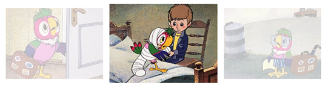

# Обработка событий

# Задание 5. Слайдер

Имеется макет веб-страницы, состоящий из файлов: index.html, script.js, style.css и папки images.

В данном макете на веб-странице расположены три изображения, представляющие слайдер. У изображения в центре страницы прозрачность не задана, в отличие от двух других, для которых она установлена равной 0,3.

В папке images хранится пять изображений: parr1.jpg, parr2.jpg, …, parr5.jpg.

**Необходимо доработать макет по требованиям:**

1. При наведении указателя мыши на центральное изображение, оно должно немного увеличиваться в размерах. При выходе из фокуса изображения его размеры должны возвращаться к исходным.

2. При каждом клике на центральном изображении должна происходить смена этого изображения в слайдере на следующее за ним изображение. Последнее изображение (parr5.jpg) должно смениться на первое (parr1.jpg) и т.д.

**Указания к выполнению задания:**

- При обработке всех пользовательских событий используйте метод addEventListener.
- Для изменения размеров изображения необходимо менять его свойство height.
- Для смены изображений в слайдере необходимо менять значение атрибута src. Используйте также вспомогательный атрибут tr.
- Для преобразования строкового значения tr в число используйте функцию parseInt(строка).

Также используйте при необходимости стандартные функции управления свойствами атрибутов элементов:

- elem.hasAttribute(name) -- проверка наличия атрибута
- elem.getAttribute(name) -- получение значения атрибута
- elem.setAttribute(name, value) -- установка значения атрибута
- elem.removeAttribute(name) -- удаление атрибута

После выполнения задания загрузите в этот репозиторий свои доработанные файлы _index.html_, _style.css_ и _script.js_.
