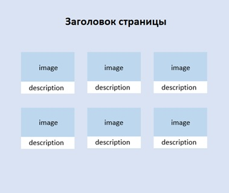

# Задание 6. Разработка компонентов Vue

Создать веб-страницу на основе фреймворка Vue для отображения контента на любую тему: товары интернет-магазина, фильмы, музыкальные альбомы и т.п. Страница сайта должна содержать следующие визуальные элементы:

1. Заголовок страницы.
2. Карточки с контентом (с изображениями и небольшим текстом/описанием). Должно быть не менее 3 карточек.

После выполнения задания загрузите в этот репозиторий свои доработанные файлы _index.html_, _style.css_ и _script.js_.

Схема страницы:

